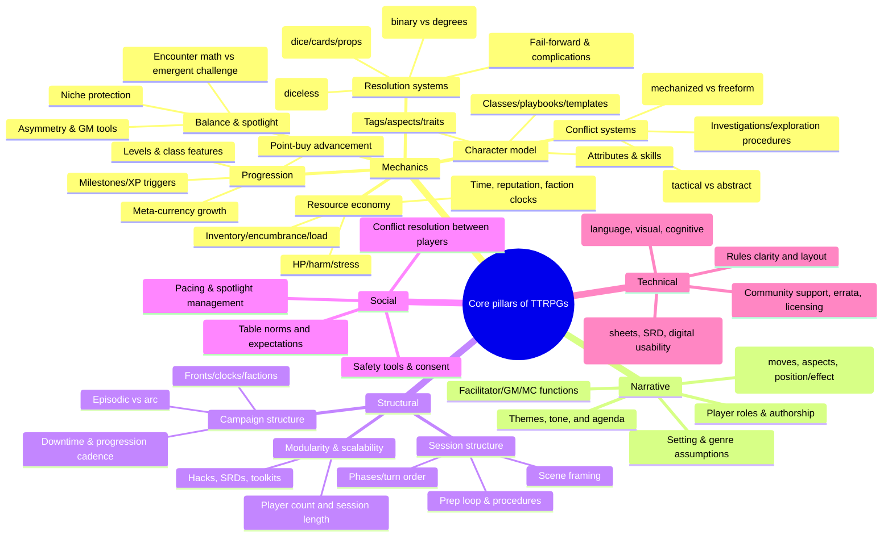
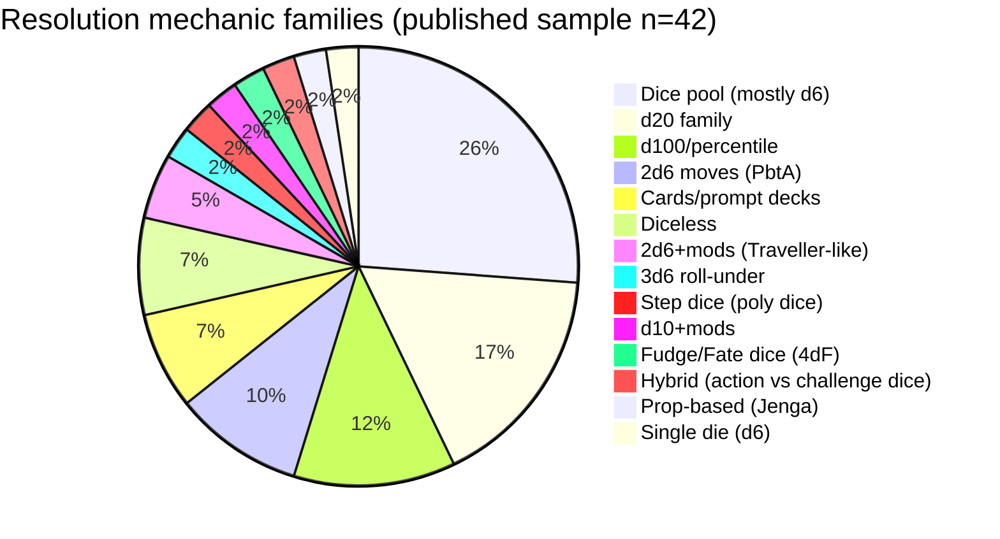
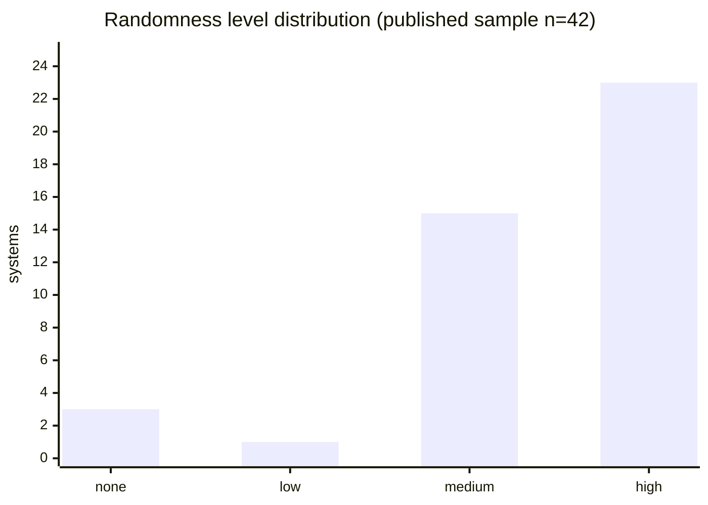
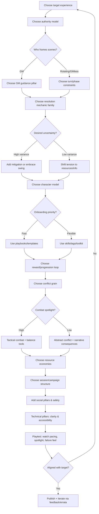

# Core Pillars of Tabletop Role-Playing Games

## Executive summary

Tabletop role-playing games (TTRPGs) are best understood as **layered design systems**: a shared conversation about fictional events, shaped by procedures for uncertainty (rules), roles (who can say what), and social practices (how the group stays safe and engaged). A widely-embraced articulation of this “conversation-first” framing appears in the Powered by the Apocalypse design essays: play proceeds via a structured conversation guided by facilitator principles and rules layers (moves, stats, GM moves, etc.). citeturn5search19turn5search14

Across **mainstream/trad**, **indie/story**, **GMless/rotating-authority**, **OSR/NSR**, and **diceless/resource** designs, the “core pillars” that most strongly determine play experience can be grouped into five domains:

- **Mechanics pillars**: how uncertainty is resolved (dice/cards/no-random), what “characters” are, how progression works, what conflicts look like, and how resources constrain choices (e.g., hit points, stress, inventory, meta-currency). citeturn0search0turn23search3turn6search0turn11search10  
- **Narrative pillars**: the game’s implied genre/setting, themes and tone, the distribution of narrative authority, and the facilitator’s job (GM, MC, Handler, Keeper, etc.). citeturn5search19turn27view0turn5search0  
- **Structural pillars**: how a session and a campaign are paced and segmented (scenes/turns/phases), how modular the system is, and how it scales (player count, complexity, campaign length). citeturn13search6turn12search1turn29view0  
- **Social pillars**: the table’s working agreements, safety/consent practices, pacing/spotlight norms, and how conflict (in fiction and at the table) is handled. citeturn17search7turn16search5turn17search1turn17search0  
- **Technical pillars**: rules clarity (language, layout, indexing), accessibility (cognitive/visual needs), and production/delivery (PDF usability, sheets, online references, SRDs). citeturn4search4turn6search0turn0search0  

Using a **comparative sample of 42 published systems** (plus a small number of explicitly labeled homebrew/custom examples), one practical “designer’s conclusion” emerges: **resolution mechanics matter, but authority distribution and reward structure matter more** for what play feels like moment-to-moment. For example, Fate’s 4dF resolution is not the main driver of its experience; its aspects and fate-point economy strongly shape player authorship and dramatic framing. citeturn23search3turn23search2turn23search10

A quick quantitative snapshot of that sample shows **dice pools are the plurality**, but the long tail contains card-driven, prompt-driven, and diceless designs—supporting a key pattern: **“TTRPG” is a medium, not a single rules genre**. citeturn12search1turn12search9turn14search5turn14search11

## Taxonomy of pillars

The taxonomy below is intentionally **compositional** (you can mix-and-match) rather than “one true model.” Many systems explicitly encourage hacking/modularity and treat their own core as a toolkit. Cortex Prime frames itself as modular and genre-buildable; the Year Zero Engine SRD similarly presents a core framework used across multiple games. citeturn9search1turn6search0

This taxonomy explicitly includes **non-dice** and **non-GM** formats that still meet common definitions of “tabletop roleplaying” in practice: prompt-deck map games (e.g., The Quiet Year), GMless history-building (Microscope), and structured “silent” or text-based play (Alice is Missing). citeturn12search1turn13search0turn12search13

## Pillar definitions, variations, examples, and trade-offs

This section defines each pillar (as requested), then analyzes variations with concrete system examples. When the same named system appears in multiple pillars, this is intentional: pillars **interlock** (a resource system often *is* a pacing system; a GM agenda often *is* a tone system). citeturn5search19turn6search0turn23search2

**Resolution systems (core uncertainty engine)**: The procedure that turns “fictional uncertainty” into a game outcome (success/failure degrees, complications, narrative control). Variations include:  
- **Binary vs degrees-of-success**: Pathfinder 2e uses “critical success/success/failure/critical failure” based on ±10 vs DC (and natural 20/1 shifts), yielding predictable “consequence granularity.” citeturn28search16turn28search14  
- **Roll-over vs roll-under**: D&D’s SRD uses roll-over target numbers; Cairn and Liminal Horror exemplify roll-under saves against abilities, often emphasizing speed and low arithmetic. citeturn0search0turn10search3turn10search19  
- **Dice pools and “count successes”**: Shadowrun’s beginner rules describe rolling handfuls of d6s; Year Zero Engine SRD similarly centers success-counting (sixes) while adding push/stress variants across implementations. citeturn29view0turn6search0  
- **Outcome bands (10+/7–9/6-)**: Apocalypse World’s “move results” are commonly expressed as strong hit / weak hit / miss; Ironsworn uses an action die vs challenge dice to generate strong/weak hit/miss outcomes. citeturn5search14turn4search16  
- **Non-dice**: Castle Falkenstein uses playing cards for resolution; The Quiet Year uses card prompts rather than skill checks; Dread uses a Jenga tower pull as the uncertainty and tension engine. citeturn14search11turn12search1turn13search14  
- **Diceless**: Amber Diceless uses ranked attribute comparison; Nobilis uses resource spending (Miracle Points) moving focus from “can you?” to “what does it cost and what are the consequences?” citeturn14search16turn14search5  

Trade-offs: binary systems are fast and easy to teach but may require extra GM creativity to “chunk” outcomes into interesting consequences; degree-based systems encode that creativity into the rules but add cognitive overhead and sometimes rules-lawyering risk. citeturn28search16turn5search14

**Character creation and character model**: How a character is represented mechanically and fictionally (stats, skills, tags, playbooks, templates). Variations include:  
- **Class-and-level** (D&D 5e SRD; many d20 descendants): strong niche protection, role clarity, and structured advancement. citeturn0search0  
- **Skill-based point-buy/advancement** (BRP SRD; Delta Green; GURPS Lite): broad concept flexibility and “skill spotlight,” but can raise complexity and optimization pressure. citeturn18search0turn27view0turn3search1  
- **Playbooks and genre packages** (Dungeon World; Monster of the Week; Masks): rapid onboarding and strong genre compliance via baked-in moves/archetypes. citeturn0search11turn5search0turn5search9  
- **Tag/aspect-based identity** (Fate): aspects are both narrative flags and mechanical handles (invocations/compels). citeturn23search2turn23search10  
- **Minimalist “inventory is character”** (Cairn, Liminal Horror): equipment slots and limited saves often become the primary differentiator, which speeds play and supports OSR/NSR emergent problem-solving. citeturn10search3turn10search19  

Trade-offs: high-structure character models simplify table expectations but can reduce experimentation; low-structure models increase creative freedom but risk “homogenization” unless the reward system pushes differentiation. citeturn0search0turn23search2

**Progression and advancement**: How characters and/or the campaign’s state changes over time. Variations include:  
- **Vertical power growth** (levels): strong sense of escalation, but may destabilize encounter balance or widen power disparities. citeturn0search0turn29view0  
- **Horizontal growth** (new moves/assets/contacts): can preserve challenge while expanding options; common in PbtA-style advances and in resource-driven systems. citeturn0search11turn4search16  
- **Meta-currency-driven growth** (Fate’s fate points in play; Nobilis miracle points in play): often emphasizes dramatic beats and consequence framing. citeturn23search10turn14search5  
- **Campaign state progression** (The Quiet Year projects and community changes; Microscope histories): the “character sheet” is partly the world. citeturn12search1turn13search0  

Trade-offs: heavy advancement systems encourage long campaigns and mastery play; light/one-shot designs often shift advancement to “story position” rather than mechanical growth (Fiasco, Dread, Alice is Missing). citeturn13search6turn13search14turn12search13

**Combat and conflict systems**: How the game handles structured conflict (violence, social conflict, chases, heists). Variations include:  
- **Tactical, option-rich combat**: D&D and Pathfinder support grid or tactical positioning; Pathfinder’s degrees-of-success ripple into combat outcomes. citeturn0search0turn28search16  
- **Fast, swingy, high-weird combat**: Dungeon Crawl Classics highlights “Mighty Deeds” as a signature combat maneuver structure. citeturn10search1  
- **Conflict as “another move”**: PbtA games often treat combat as one of many genre moves, compressing combat detail to preserve pacing. citeturn0search11turn5search0  
- **Position/effect + stress as control knobs**: Blades in the Dark frames action resolution through action ratings and consequences, with stress as a key pressure valve. citeturn0search2  
- **Horror pressure engines**: Mothership frames stress accumulation and panic checks as “heat” that forces hard choices; Ten Candles structurally guarantees tragedy as candles/dice diminish. citeturn11search10turn12search12  

Trade-offs: detailed combat can deliver tactical fun and clear fairness, but risks dominating session time; abstract conflict frees time for investigation/social drama but expects more shared genre understanding. citeturn0search0turn5search0turn12search12

**Social/skill systems and “what gets mechanized”**: Which actions receive explicit rules and how those rules shape spotlight. Variations include:  
- **Universal skill lists** (BRP SRD; Delta Green; Mythras): coverage is broad; the system can feel simulation-forward, but requires careful skill list design and GM guidance to avoid “roll spam.” citeturn18search0turn27view0turn11search4  
- **Genre moves** (Monster of the Week reference sheets; Masks basic moves): mechanics explicitly point at genre tropes (investigate a mystery, directly engage a threat, etc.). citeturn5search0turn5search9  
- **Fictional permissions** (Cairn saves; OSR procedures): many actions are resolved by the fiction first, with dice as a last resort. citeturn10search3turn11search10  
- **Prompt-driven roleplay** (The Quiet Year; Alice is Missing): “skills” are replaced by constrained prompts that turn social play into structured creation. citeturn12search1turn12search13  

Trade-offs: mechanizing social conflict can improve fairness and reduce GM bias but may gamify emotional topics; leaving it freeform can feel natural but relies heavily on group trust and facilitation skill. citeturn16search5turn17search7

**Resource management and economies (pressure, scarcity, “cost of agency”)**: Resources create stakes and pacing by limiting retries and forcing prioritization. Common resource families:  
- **Health/harm tracks**: D&D HP; BRP-style hit points; Mothership stress/panic; Year Zero stress rules. citeturn0search0turn18search0turn11search10turn6search0  
- **Meta-currency**: Fate points (buy bonuses/rerolls); Blades stress (resist consequences); Nobilis miracle points. citeturn23search10turn0search2turn14search5  
- **Inventory/load**: Cairn’s inventory slots; many OSR/NSR designs treat inventory as a pacing and risk-management pillar. citeturn10search3turn10search19  
- **Escalation dice/resources**: Ten Candles’ diminishing dice pool tied to candles; the mechanic structurally enforces tone. citeturn12search12  

Trade-offs: scarcity mechanics intensify tension and decision-making but can produce “cautious play” or analysis paralysis; generous resources increase heroism but can flatten stakes unless consequences are narrative/positional. citeturn11search10turn23search10

**Randomness and uncertainty management**: Randomness is not just “dice vs no dice,” but also *how manipulable* outcomes are.  
- Fate explicitly allows spending fate points for +2 or rerolls via aspect invocations, softening pure dice variance. citeturn23search10turn23search2  
- Ironsworn compares an action score to two d10 challenge dice, producing partial success bands and encouraging forward motion even on weak hits. citeturn4search16  
- Year Zero’s stress dice can raise success odds but introduce panic risk, converting randomness into a risk-reward pressure dial. citeturn6search0turn7search0  
- Diceless designs (Nobilis) reduce outcome uncertainty, shifting tension to resource depletion and social/narrative consequences. citeturn14search5  

Trade-offs: high randomness increases drama and replayability but can frustrate if failure is frequent and uninteresting; low randomness supports strategic play and authorial storytelling but can feel scripted unless other uncertainty (information gaps, competing agendas) is strong. citeturn6search0turn14search5

**Balance, spotlight, and fairness**: “Balance” in TTRPGs usually means some mix of (a) mechanical parity, (b) spotlight equity, and (c) reliable genre compliance.  
- Class-and-level games often balance by niche protection and bounded options; skill-based games balance by broad competence but must manage “skill dominance.” citeturn0search0turn18search0  
- PbtA playbooks balance by ensuring each archetype has strong genre moves, often tied to advancement triggers. citeturn0search11turn5search0  
- GMless games like Fiasco shift “balance” away from mechanical fairness toward narrative turn-taking structures across acts and aftermath. citeturn13search6  

Trade-offs: tight mechanical balance can reduce GM burden and social friction but can also narrow creative problem-solving; looser balance supports emergent play but demands stronger social contracts and facilitator judgment. citeturn27view0turn17search7

**Setting, themes, and tone (narrative identity pillars)**: Many games bake tone into procedures, not just prose:  
- Ten Candles explicitly structures tragedy and inevitability through candle/dice depletion. citeturn12search12  
- The Quiet Year encodes “community struggle between disasters” via weekly prompts and an inevitable winter ending. citeturn12search1  
- Mothership’s stress and panic framing pushes horror pacing. citeturn11search10  
- Microscope’s “no GM, no prep” world-history play creates a different tone: authorship and discovery, not survival or heroism. citeturn13search0  

Trade-offs: strong thematic enforcement helps tables get “the promised experience” quickly but reduces genre flexibility; toolkits and generic engines increase adaptability but require more design effort by the group (or demand supplements). citeturn6search0turn9search1turn13search0

**Player roles and GM/MC functions (authority distribution)**: A core pillar is *who has the right to introduce facts, frame scenes, call for rolls, and interpret results*.  
- Traditional GM frameworks are clearly stated in beginner materials like Shadowrun’s quick-start rules (GM arranges major beats; players roll). citeturn29view0  
- PbtA formalizes the MC’s agenda/principles and “MC moves,” emphasizing “play to find out what happens.” citeturn5search19turn5search14  
- Delta Green renames the facilitator “Handler” and describes the role as narrator/referee/host and controller of threats and consequences. citeturn27view0  
- GMless and rotating-authority games (Microscope; Fiasco) solve authority distribution through strict turn structures and phase rules. citeturn13search0turn13search6  

Trade-offs: centralized GM authority reduces coordination costs and can improve pacing, but risks bias or burnout; distributed authority increases player agency and creative ownership but benefits from clear constraints (turns, prompts, tools). citeturn13search0turn17search0

**Session structure and campaign structure (how play is packaged)**: Structure converts a “ruleset” into a repeatable practice.  
- Fiasco’s two acts + tilt + aftermath is an explicit session-level structure with designed pacing. citeturn13search6  
- The Quiet Year uses 52 cards as “weeks,” turning the session into a countdown. citeturn12search1  
- Shadowrun’s beginner rules explicitly acknowledge sessions can be “a few hours” while campaigns can run years—an important structural expectation cue. citeturn29view0  
- Many OSR/NSR-adjacent games rely on procedures for exploration, time, and logistics, making “procedure” itself a structural pillar (often supported by random tables, travel rules, encounter checks). citeturn10search3turn6search0  

Trade-offs: strong structures help onboarding and consistency; loose structures preserve table autonomy but make outcomes more dependent on facilitator skill and group habits. citeturn13search6turn29view0

**Modularity and scalability**: Whether the system is a fixed experience or a toolkit, and how it supports different player counts/lengths.  
- Cortex Prime explicitly positions itself as a buildable modular system for genre tailoring. citeturn9search1turn21search10  
- Year Zero’s SRD is explicitly presented as a core engine used across multiple games. citeturn6search0  
- Microscope cautions about play group continuity and uses lightweight roles (e.g., Lens) to manage focus, supporting multi-session continuation but with constraints. citeturn13search9turn13search0  

Trade-offs: high modularity helps designers and homebrewers but increases learning burden and can create “option overload”; tightly scoped games reduce choices and improve coherence. citeturn9search1turn12search1

**Table dynamics, safety tools, consent, and pacing (social pillars)**: Modern TTRPG practice increasingly treats safety and consent as first-class design and table pillars.  
- The Roll20 Lines and Veils primer frames safety tools as pre/during/after communication resources. citeturn17search7  
- Consent in Gaming provides concrete consent strategies and includes a checklist format for calibrating content boundaries. citeturn16search5turn16search9  
- Script Change defines “rewind/fast-forward/pause” style tools and is distributed under a Creative Commons license, explicitly encouraging reuse with attribution. citeturn17search3turn17search9  
- The TTRPG Safety Toolkit is a curated, living resource explicitly designed to centralize safety tools in the space. citeturn17search0turn17search2  

Trade-offs: safety tools can slightly increase session overhead but significantly reduce harm risk and improve trust—especially in public play, new groups, horror themes, or emotionally intense scenarios. citeturn16search5turn17search0

**Rules clarity, accessibility, and production (technical pillars)**: These pillars determine whether a system is playable as written.  
- Ironsworn’s official distribution emphasizes a complete, searchable, bookmarked digital package—production choices that directly affect usability. citeturn4search4  
- SRDs and online references (e.g., Fate SRD; Cairn SRD; Year Zero SRD) reduce access barriers and support community hacking. citeturn23search3turn10search3turn6search0  
- Beginner-box/quickstart documents (Shadowrun Beginner Box QSR; DCC QSR; Call of Cthulhu Quick-Start) represent a technical pillar: teaching flow and progressive disclosure. citeturn29view0turn10search1turn1search1  

Trade-offs: high production value and clarity cost time/money; minimal production enables rapid iteration and indie distribution but can limit adoption or reduce accessibility for new players. citeturn4search4turn10search3

## Comparative matrix and summary charts

The table below compares **42 published systems** plus **3 explicitly labeled homebrew/custom examples** across the requested dimensions. Ratings for “player agency,” “narrative focus,” and “crunch level” are **analytic judgments** based on each system’s explicit authority tools (e.g., meta-currency, GMless structures, move-driven play) and rule density, not value judgments.

**Scale notes (interpretive, used consistently):**  
- **Player agency**: *Low* = mostly tactical/character-first with limited authorial tools; *High* = explicit player authorship levers (aspects, scene framing, GMless turns, etc.). citeturn23search2turn13search0turn13search6  
- **Randomness**: *None* = diceless; *Low* = minimal randomization or mostly prompt-driven; *High* = frequent roll-driven outcomes. citeturn14search5turn12search1turn29view0  

| System | Resolution mechanic | Player agency | GM role | Randomness | Narrative focus | Crunch | Typical session length |
|---|---|---|---|---|---|---|---|
| entity["video_game","Dungeons & Dragons","tabletop rpg 5e"] | d20 roll-over vs DC (core SRD) citeturn0search0 | Medium | Traditional GM | High | Medium | Medium | Unspecified |
| entity["video_game","Pathfinder Second Edition","tabletop rpg 2019"] | d20 vs DC + degrees of success (±10) citeturn28search16turn28search14 | Medium | Traditional GM | High | Medium | Crunchy | Unspecified |
| entity["video_game","Basic Fantasy Role-Playing Game","tabletop rpg free"] | d20 roll-over (OSR-style) citeturn10search4 | Medium | Traditional GM | High | Medium | Medium | Unspecified |
| entity["video_game","Dungeon Crawl Classics","tabletop rpg"] | d20-based; “Mighty Deed” combat hooks citeturn10search1 | Medium | Traditional GM (“Judge”) | High | Medium | Medium | Unspecified |
| entity["video_game","Cairn","tabletop rpg"] | d20 roll-under saves; inventory slots central citeturn10search3 | High | Traditional GM (light) | Medium | Medium | Light | Unspecified |
| entity["video_game","MÖRK BORG","tabletop rpg"] | d20 ± ability vs DR (tests) citeturn2search19turn3search2 | Medium | Traditional GM | High | High (tone-forward) | Light | Unspecified |
| entity["video_game","Liminal Horror","tabletop rpg"] | d20 roll-under saves + inventory slots citeturn10search19 | High | Traditional GM (light) | Medium | High (horror-forward) | Light | Unspecified |
| entity["video_game","Call of Cthulhu","tabletop rpg 7e"] | Percentile (d100) skills; roll-under citeturn1search1 | Medium | Traditional GM (“Keeper”) | High | High | Medium | Unspecified |
| entity["video_game","Basic Roleplaying","chaosium brp srd"] | Percentile (d100) roll-under skill system citeturn18search0 | Medium | Traditional GM | High | Medium | Medium | Unspecified |
| entity["video_game","Mythras Imperative","d100 system"] | d100/percentile skill system (open SRD) citeturn11search4turn11search16 | Medium | Traditional GM | High | Medium | Medium | Unspecified |
| entity["video_game","Delta Green","ttrpg need to know"] | Percentile dice resolution (d100) citeturn27view0 | Medium | Traditional GM (“Handler”) citeturn27view0 | High | High | Medium | Unspecified |
| entity["video_game","Mothership","ttrpg 1e"] | d100 roll-under; failure adds Stress; Stress → Panic check citeturn11search10 | Medium | Traditional GM (“Warden”) | High | High (horror) | Light | Unspecified |
| entity["video_game","GURPS Lite","universal rpg"] | 3d6 roll-under (distilled rules) citeturn3search1turn3search9 | Medium | Traditional GM | High | Medium | Crunchy | Unspecified |
| entity["video_game","Savage Worlds","test drive rules"] | Trait die + Wild die; target numbers citeturn1search3 | Medium | Traditional GM | High | Medium | Medium | Unspecified |
| entity["video_game","Shadowrun: Sixth World Beginner Box","quick start rules"] | d6 dice pools: skill ranks = dice; GM adjudicates citeturn29view0 | Medium | Traditional GM | High | Medium | Crunchy | Few hours / variable citeturn29view0 |
| entity["video_game","Cyberpunk RED","easy mode"] | d10 + STAT + Skill vs DV citeturn22search16 | Medium | Traditional GM | High | Medium | Medium | Unspecified |
| entity["video_game","Cepheus Engine","2d6 sci-fi srd"] | 2d6 + modifiers vs target (often 8+) citeturn18search10turn18search11 | Medium | Traditional GM | Medium | Medium | Medium | Unspecified |
| entity["video_game","Traveller SRD","2d6 system"] | 2d6 + modifiers vs target numbers citeturn18search3turn18search22 | Medium | Traditional GM | Medium | Medium | Medium | Unspecified |
| entity["video_game","D6 Fantasy","open d6 system"] | d6 dice pools (sum + pips framework) citeturn11search23turn11search3 | Medium | Traditional GM | High | Medium | Medium | Unspecified |
| entity["video_game","Castle Falkenstein","card-based rpg"] | Playing-card skill resolution (hand management) citeturn14search11 | Medium | Referee + cards | Medium | High | Medium | Unspecified |
| entity["video_game","Amber Diceless Roleplaying Game","diceless rpg"] | Diceless ranked attribute comparison citeturn14search16 | High | GM adjudication-heavy | None | High | Medium | Unspecified |
| entity["video_game","Nobilis","diceless rpg"] | Diceless; spend Miracle Points; focus on consequences citeturn14search5 | High | GM + shared worldbuilding | None | High | Crunchy | Unspecified |
| entity["video_game","Fate Core","fate srd"] | 4dF; invoke aspects with fate points (+2/reroll) citeturn23search3turn23search10turn23search2 | High | GM (often scene-focused) | Medium | High | Medium | Unspecified |
| entity["video_game","Apocalypse World","pbta 2e"] | 2d6+stat moves: 10+ / 7–9 / 6- citeturn5search14turn5search2 | High | MC with agenda/principles citeturn5search19 | Medium | High | Medium | Unspecified |
| entity["video_game","Dungeon World","pbta fantasy"] | 2d6 moves; 6- often triggers GM move/XP citeturn0search11turn0search3 | High | GM as MC-style facilitator | Medium | High | Medium | Unspecified |
| entity["video_game","Monster of the Week","pbta"] | 2d6 moves with 10+ / 7–9 / miss citeturn5search0 | High | “Keeper” (GM) citeturn5search0 | Medium | High | Medium | Unspecified |
| entity["video_game","Masks: A New Generation","pbta"] | 2d6 basic moves (hit bands) citeturn5search9 | High | GM (young-heroes drama) | Medium | High | Medium | Unspecified |
| entity["video_game","Blades in the Dark","forged in the dark"] | d6 dice pool; take highest; action roll + consequences citeturn0search2 | High | GM + structured procedures | Medium | High | Medium | Unspecified |
| entity["video_game","Ironsworn","solo co-op guided rpg"] | Action die (d6) vs two d10 challenge dice; strong/weak hit/miss citeturn4search16turn4search4 | High | Solo/co-op/guided variants citeturn4search4 | Medium | High | Medium | Unspecified |
| entity["video_game","Year Zero Engine","free league srd"] | d6 pool; sixes = successes; stress/push variants in SRD citeturn6search0turn33search7 | Medium | Traditional GM | High | Medium | Medium | Unspecified |
| entity["video_game","Alien: The Roleplaying Game","year zero engine"] | YZE dice pool + Stress Dice; stress increases success but can trigger panic citeturn7search0turn6search0 | Medium | Traditional GM | High | High (horror/sci-fi) | Medium | Unspecified |
| entity["video_game","Forbidden Lands","free league rpg"] | YZE-style dice pool; “push” and travel/survival procedures (quickstart) citeturn30view0turn7search5 | Medium | Traditional GM | High | Medium | Medium | Unspecified |
| entity["video_game","Mutant: Year Zero","free league rpg"] | Dice pool; push skills to limits; mutant-power risk/reward citeturn34view0turn33search18 | Medium | Traditional GM | High | Medium | Medium | Unspecified |
| entity["video_game","Ten Candles","horror ttrpg"] | d6 pool = candles lit; success on any 6; failure blows out candle citeturn12search12 | Medium | GM (tragic horror) | High | High | Light | Unspecified |
| entity["video_game","Dread","jenga horror rpg"] | Pull from Jenga tower for meaningful actions; collapse eliminates character citeturn13search14 | Medium | GM (tension pacing) | Medium | High | Light | Unspecified |
| entity["video_game","Fiasco","gm-less caper rpg"] | GMless; d6 setup + acts + tilt + aftermath citeturn13search6 | High | Facilitated by structure | Medium | High | Light | 1–3 hours citeturn13search6 |
| entity["video_game","The Quiet Year","map-drawing rpg"] | Deck of cards as weeks and prompts; GMless map game citeturn12search1 | High | Facilitator/GMless | Medium | High | Light | 3–4 hours citeturn12search11 |
| entity["video_game","Microscope","gm-less worldbuilding rpg"] | No GM, no prep; structured turns create history citeturn13search0 | High | Rotating “Lens” role citeturn13search9 | None | High | Light | Unspecified |
| entity["video_game","Alice is Missing","silent rpg"] | Silent text-message play; timer-driven session citeturn12search13turn12search17 | High | Facilitator guides setup | Low | High | Light | 90 minutes citeturn12search13 |
| entity["video_game","Lasers & Feelings","one-page rpg"] | 1d6 vs target number; rules-light one-pager citeturn3search3 | High | GM-light | High | High | Light | Unspecified |
| entity["video_game","Honey Heist","one-page rpg"] | Two-stat structure (“Bear” vs “Criminal”) with simple resolution citeturn3search20 | High | GM-light | High | High | Light | Unspecified |
| entity["video_game","Risus: The Anything RPG","rules-light rpg"] | d6 “cliché” dice pools citeturn4search1 | High | GM-light | High | Medium | Light | Unspecified |
| Homebrew/custom example | d20 roll-over + clocks + stress tokens (example) | High | Rotating facilitator | High | High | Light | Unspecified |
| Homebrew/custom example | Diceless coin-bid social conflict (example) | High | Facilitator | None | High | Medium | Unspecified |
| Homebrew/custom example | Tarot/prompt deck with scene authority rules (example) | High | GMless or facilitator | Medium | High | Light | Unspecified |

### Mechanics distribution in the published sample

Below are two charts summarizing the sample (42 published systems only; homebrew/custom examples excluded). Counts come from the classification used in the comparative table above.

## Cross-cutting patterns and common archetypes

Several patterns recur across “popular,” “obscure,” “indie,” and “custom/homebrew” systems—often independent of genre.

A dominant cross-cutting pattern is the **fiction → procedure → fiction loop**: the table describes intent, the system triggers a procedure (move/check/pull/draw), and then the table reincorporates the outcome into fiction. PbtA essays explicitly describe this layered conversation model (core conversation, then stats/moves/harm, etc.). citeturn5search19turn5search14

A second pattern is that **tone is frequently procedural**, not merely descriptive. Ten Candles enforces tragic inevitability by mechanically reducing dice/candles; The Quiet Year enforces “countdown to winter” via a deck-as-calendar; Mothership enforces fear escalation via stress → panic. citeturn12search12turn12search1turn11search10

A third pattern is that **authority distribution** predicts playfeel more reliably than raw probability curves. Compare:
- Fate (shared authorship levers through aspects and fate points), citeturn23search2turn23search10  
- Blades (structured consequences + stress as resistance), citeturn0search2  
- Shadowrun/D&D (traditional GM with heavier simulation/tactical affordances). citeturn29view0turn0search0  

Common archetypes (useful for designers) include:

- **Trad tactical adventure**: centralized GM, robust combat rules, class niches (D&D, Pathfinder). citeturn0search0turn28search16  
- **Skill-forward investigation/horror**: percentile skills, sanity/trauma subsystems, strong GM pacing role (Call of Cthulhu, Delta Green). citeturn1search1turn27view0  
- **Move-driven genre emulation**: PbtA playbooks/moves, explicit GM agendas/principles (Apocalypse World, Monster of the Week, Masks). citeturn5search19turn5search0turn5search9  
- **Consequence-forward heist/drama**: explicit consequence/position tools and meta-currencies (Blades, Fate). citeturn0search2turn23search10  
- **OSR/NSR minimalist problem-solving**: roll-under saves, inventory pressure, fiction-first rulings (Cairn, Liminal Horror). citeturn10search3turn10search19  
- **Prompt-driven or GMless authorship**: turn structures replace GM authority (Fiasco, Microscope, The Quiet Year). citeturn13search6turn13search0turn12search1  
- **Diceless consequence/resource drama**: determinism shifts tension to resource costs and political fallout (Nobilis, Amber Diceless). citeturn14search5turn14search16  

## Design decision framework

This framework is meant for system designers (including indie and homebrew authors) choosing “pillars” deliberately. It is grounded in the observation that many successful designs explicitly tie their procedures to intended experience (e.g., PbtA agendas; Fate aspect economy; stress/panic loops in horror engines). citeturn5search19turn23search2turn6search0turn11search10

### How to use the framework

Start by defining the **target experience** in operational terms (“90-minute silent mystery,” “heist with escalating consequences,” “open-world survival sandbox,” “tragic horror one-shot”). Games like Alice is Missing explicitly communicate duration and format; The Quiet Year communicates its seasonal countdown; Shadowrun beginner materials communicate “few hours per session, campaigns can run long.” citeturn12search13turn12search1turn29view0

Then choose an **authority model** early, because it constrains everything else:  
- GM-centered models need GM-facing procedures and clarity (Shadowrun; Delta Green). citeturn29view0turn27view0  
- GMless models need explicit turn rules and conflict-handling procedures (Fiasco; Microscope). citeturn13search6turn13search9  

Finally, validate alignment by playtesting a few key “stress cases”: repeated failure, spotlight imbalance, and emotionally intense content. Modern safety toolkits and consent frameworks exist specifically to manage these cases proactively. citeturn17search0turn16search5turn17search7

## Sources and limitations

### Primary and near-primary sources emphasized in this report

This report prioritized official SRDs, official product/preview documents, and first-party rules references where available: D&D SRD 5.1 citeturn0search0; Fate SRD (dice ladder, aspects, fate points) citeturn23search3turn23search2turn23search10; Year Zero Engine SRD citeturn6search0turn33search7; Cairn SRD citeturn10search3; Basic Roleplaying SRD citeturn18search0; Pathfinder 2e rules references (degrees of success) citeturn28search16turn28search14; Ironsworn action roll overview citeturn4search16turn4search4; and multiple widely used quick-start/beginner documents (e.g., Shadowrun Beginner Box QSR; DCC QSR; Call of Cthulhu Quick-Start). citeturn29view0turn10search1turn1search1

For social/safety pillars, it relied on widely cited modern tools and repositories: Consent in Gaming (PDF and checklist) citeturn16search5turn16search9; Script Change (official pages) citeturn17search3turn17search9; Roll20’s Lines and Veils primer citeturn17search7; and the TTRPG Safety Toolkit (official site and guide). citeturn17search0turn17search2

### Limitations and gaps

This report is **not literally exhaustive of “every TTRPG ever made”**: the space includes thousands of indie releases, one-page micro-RPGs, private hacks, and table-local homebrew, many without stable public documentation. The report therefore uses a **large, varied sample** (42 published systems with citations) and adds explicitly labeled **homebrew/custom examples** to illustrate how pillars generalize beyond published texts.

Some systems in the table rely on **secondary but reputable summaries** (notably Wikipedia for historically important but harder-to-source texts like Castle Falkenstein, Amber Diceless, and Nobilis). citeturn14search11turn14search16turn14search5 This is a deliberate trade-off to keep the sample diverse while still providing traceable references.

Finally, several requested dimensions (especially “typical session length”) are frequently **table-dependent** and not consistently specified in rulebooks; where a system explicitly states duration (Alice is Missing; Fiasco; The Quiet Year; Shadowrun QSR), the table reflects that; otherwise it is marked “unspecified.” citeturn12search13turn13search6turn12search11turn29view0